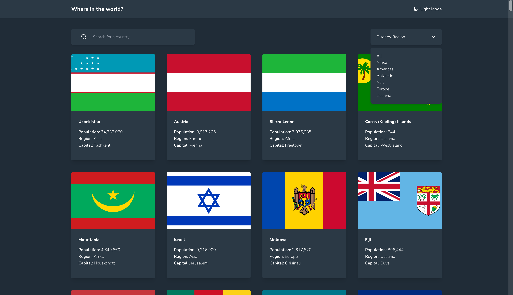
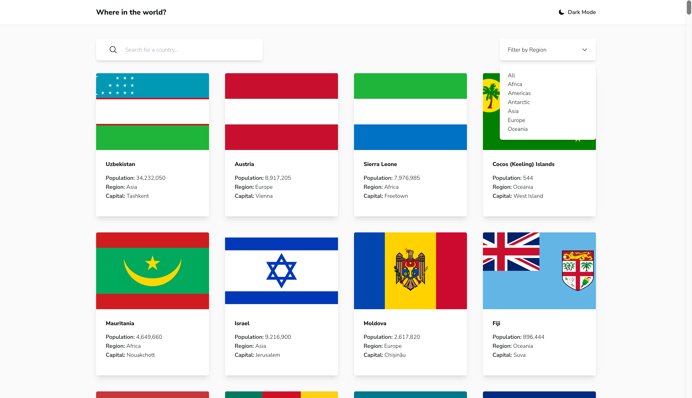
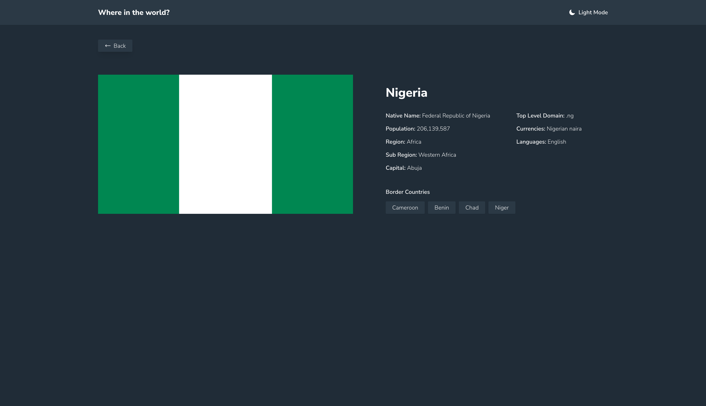
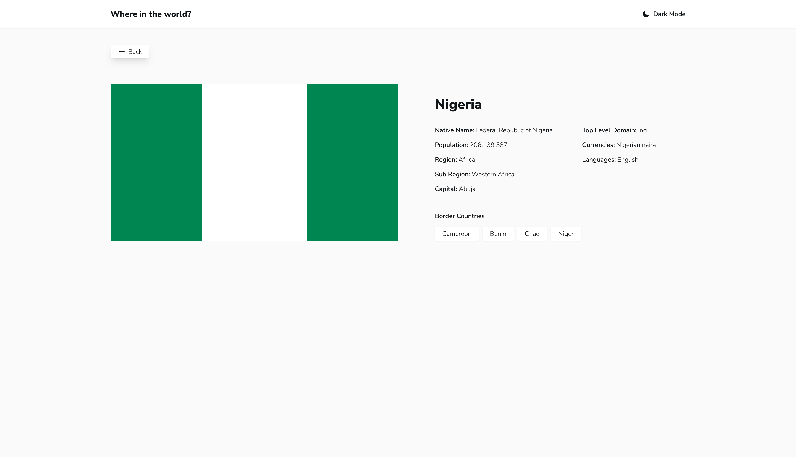
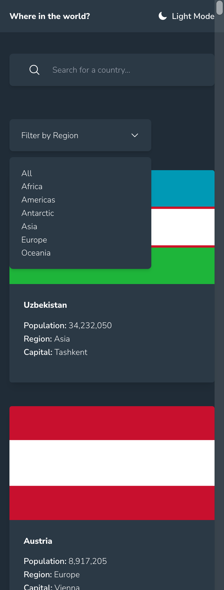
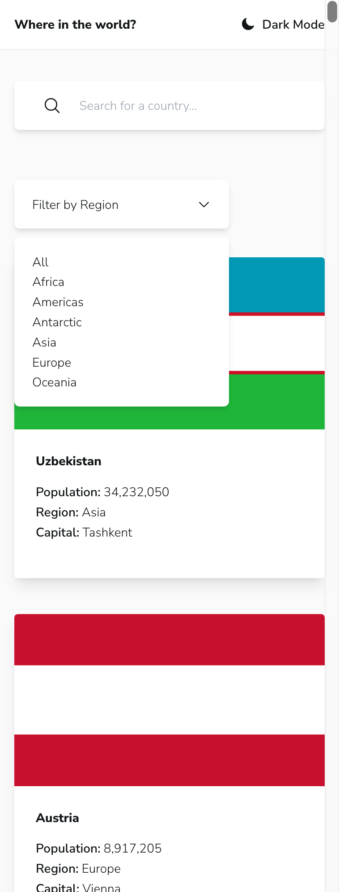
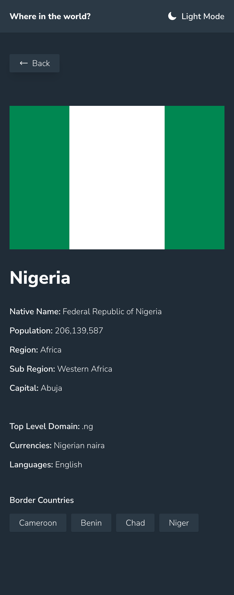
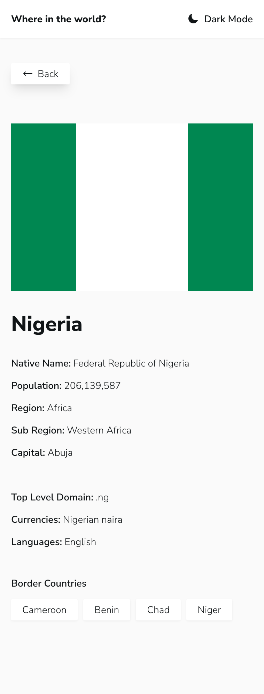

# Frontend Mentor - REST Countries API with color theme switcher solution built using vite, vue3, tailwindcss and pinia

This is a solution to the [REST Countries API with color theme switcher challenge on Frontend Mentor](https://www.frontendmentor.io/challenges/rest-countries-api-with-color-theme-switcher-5cacc469fec04111f7b848ca). Frontend Mentor challenges help you improve your coding skills by building realistic projects. 

## Table of contents

- [Overview](#overview)
  - [The challenge](#the-challenge)
  - [Screenshot](#screenshot)
  - [Links](#links)
- [My process](#my-process)
  - [Built with](#built-with)
  - [What I learned](#what-i-learned)
  - [Continued development](#continued-development)
- [Author](#author)

## Overview

### The challenge

Users should be able to:

- See all countries from the API on the homepage
- Search for a country using an `input` field
- Filter countries by region
- Click on a country to see more detailed information on a separate page
- Click through to the border countries on the detail page
- Toggle the color scheme between light and dark mode *(optional)*

### Screenshot

### Links

- Solution URL: [Add solution URL here](https://github.com/Mapelsun/rest-countries-app)
- Live Site URL: [Add live site URL here](https://magnificent-pony-e14ede.netlify.app/)

## My process

### Built with

- Semantic HTML5 markup
- CSS custom properties
- Flexbox
- CSS Grid
- Mobile-first workflow
- [Vite](https://vitejs.dev/) - Bundler
- [Vue3](https://vuejs.org/) - JS framework
- [Pinia](https://pinia.vuejs.org/) - Store
- [TailwindCSS](https://tailwindcss.com/) - For styles

### What I learned

I tried to focus on performance and speed, hence, only one api call is made on load to get all countries. No other api call within the app apart from image source attributes.

### Continued development

Possible refactor at a later date and some bug fixes.

## Author

- Website - [Pelumi Majolagbe](https://pelumi.dev/)
- Frontend Mentor - [@Mapelsun](https://www.frontendmentor.io/profile/Mapelsun)
- Twitter - [@Mapelsun](https://www.twitter.com/Mapelsun)
